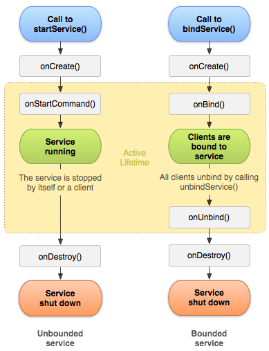

## 三、Service

[sevice官网](https://developer.android.com/guide/components/services?hl=zh-cn)

Service
是一种可在后台执行长时间运行操作而不提供界面的应用组件。服务可由其他应用组件启动，而且即使用户切换到其他应用，服务仍将在后台继续运行。此外，组件可通过绑定到服务与之进行交互，甚至是执行进程间通信
(IPC)。例如，服务可在后台处理网络事务、播放音乐，执行文件 I/O
或与内容提供程序进行交互。

#### 1、后台 Service 限制

系统可以区分前台和后台应用。 （用于 Service
限制目的的后台定义与内存管理使用的定义不同；一个应用按照内存管理的定义可能处于后台，但按照能够启动
Service 的定义又处于前台。）如果满足以下任意条件，应用将被视为处于前台：

- 具有可见 Activity（不管该 Activity 已启动还是已暂停）。 
- 具有前台 Service。
- 另一个前台应用已关联到该应用（不管是通过绑定到其中一个
Service，还是通过使用其中一个内容提供程序）。 例如，如果另一个应用绑定到该应用的
Service，那么该应用处于前台： 
 - IME 
 - 壁纸 
 - Service 通知侦听器 
 - 语音或文本 Service
如果以上条件均不满足，应用将被视为处于后台

**请注意**：这些应用不会对绑定 Service 产生任何影响。 如果您的应用定义了绑定
Service，则不管应用是否处于前台，其他组件都可以绑定到该 Service。

在这些情况下，后台应用将被置于一个临时白名单中并持续数分钟。
位于白名单中时，应用可以无限制地启动 Service，并且其后台 Service 也可以运行。
处理对用户可见的任务时，应用将被置于白名单中，例如：

1. 处理一条高优先级 Firebase 云消息传递 (FCM)消息。
2. 接收广播，例如短信/彩信消息。
3. 从通知执行 PendingIntent。
4. 在 VPN 应用将自己提升为前台进程前开启 VpnService。

**请注意**： IntentService 是一项 Service，因此其遵守针对后台 Service 的新限制。
因此，许多依赖 IntentService 的应用在适配 Android 8.0 或更高版本时无法正常工作。
出于这一原因，Android 支持库
26.0.0 引入了一个新的JobIntentService类，该类提供与 IntentService 相同的功能，但在
Android 8.0 或更高版本上运行时使用作业而非 Service。

在很多情况下，您的应用都可以使用 JobScheduler 作业替换后台 Service。
例如，CoolPhotoApp
需要检查用户是否已经收到好友共享的照片，即使该应用未在前台运行也需如此。
之前，应用使用一种会检查其云存储的后台 Service。 为了迁移到 Android 8.0（API 级别
26），开发者使用一个计划作业替换了这种后台
Service，该作业将按一定周期启动，查询服务器，然后退出。

在 Android 8.0 之前，创建前台 Service 的方式通常是先创建一个后台
Service，然后将该 Service 推到前台。 Android 8.0
有一项复杂功能：系统不允许后台应用创建后台 Service。 因此，Android 8.0
引入了一种全新的方法，即 startForegroundService()，以在前台启动新 Service。
在系统创建 Service 后，应用有五秒的时间来调用该 Service
的 startForeground() 方法以显示新 Service 的用户可见通知。
如果应用在此时间限制内未调用 startForeground()，则系统将停止此 Service
并声明此应用为 ANR

- service生命周期

### 1.service 的生命周期，两种启动方式的区别

1. 如果组件通过调用 startService() 启动服务（这会引起对 onStartCommand() 的调用），则服务会一直运行，直到其使用 stopSelf() 自行停止运行，或由其他组件通过调用 stopService() 将其停止为止。
如果服务已经被创建，多次调用startService启动服务，会重复调用onStartCommand()方法

2. 如果组件通过调用 bindService() 来创建服务，且未调用 onStartCommand()，则服务只会在该组件与其绑定时运行。当该服务与其所有组件取消绑定后，系统便会将其销毁。
 如果服务已经被创建，多次调用bindService绑定服务，并不会重复调用onBind()方法

**注意：**如果服务被绑定以后，多次调用解绑会崩溃

只有在内存过低且必须回收系统资源以供拥有用户焦点的 Activity 使用时，Android
系统才会停止服务。如果将服务绑定到拥有用户焦点的
Activity，则它其不太可能会终止；如果将服务声明为在前台运行，则其几乎永远不会终止。如果服务已启动并长时间运行，则系统逐渐降低其在后台任务列表中的位置，而服务被终止的概率也会大幅提升—如果服务是启动服务，则您必须将其设计为能够妥善处理系统执行的重启。如果系统终止服务，则其会在资源可用时立即重启服务，但这还取决于您从 onStartCommand() 返回的值

-已启动并且还允许绑定的服务的生命周期，如下所示:

### 2、Service与Activity怎么实现通信 ###

通过Binder或者广播通信

###4.IntentService是什么,IntentService原理，应用场景及其与Service的区别

 IntentService是 Service 的子类，其使用工作线程逐一处理所有启动请求。如果不要求服务同时处理多个请求，此类为最佳选择。实现 onHandleIntent()，该方法会接收每个启动请求的 Intent，以便执行后台工作

IntentService原理 
原理是继承Service,并使用Handler开启一个子线程处理请求

由于大多数启动服务无需同时处理多个请求，因此选择是利用 IntentService 类实现服务。

IntentService 类会执行以下操作：

- 创建默认的工作线程，用于在应用的主线程外执行传递给 onStartCommand() 的所有 Intent。

- 创建工作队列，用于将 Intent 逐一传递给 onHandleIntent() 实现，这样您就永远不必担心多线程问题。

- 在处理完所有启动请求后停止服务，因此您永远不必调用 stopSelf()。

- 提供 onBind() 的默认实现（返回 null）。

- 提供 onStartCommand() 的默认实现，可将 Intent 依次发送到工作队列和 onHandleIntent() 实现。
- 
如要完成客户端提供的工作，请实现 onHandleIntent()。并且需要提供一个无参构造函数。

####5.Service 的 onStartCommand 方法有几种返回值?各代表什么意思?

- START _NOT _STICKY

  如果系统在 onStartCommand() 返回后终止服务，系统不会自动重启该服务。

- START_STICKY

如果系统在 onStartCommand() 返回后终止服务，则其会重建服务并调用 onStartCommand()，但不保留 Intent。

- START _REDELIVER _INTENT

重传Intent。使用这个返回值时，如果在执行完onStartCommand后，服务被异常kill掉，系统会自动重启该服务，并将Intent的值传入。

###6.bindService和startService混合使用的生命周期以及怎么关闭

- 先start service后bind service生命周期过程

- 先bind service后start service生命周期过程

 bindService和startService混合使用，无论是先启动服务还是绑定服务，stopService()或者stopSelf()只需要调一次即可，但是解绑服务需要把所有绑定在服务上的的组键都解绑，服务才会被销毁

- start service和bind service生命周期混合使用onUnBind()返回true的生命周期

onUnBind()返回true或者false只是决定重新绑定service的时候是否调用onRebind(),返回true重新绑定service的时候调用onRebind(),返回false不调用