## 二、 事件分发

[事件分发学习网站](https://www.cnblogs.com/chengxuyinli/p/9979826.html)

- MotionEvent
- ACTION_DOWN = 0
- ACTION_UP = 1
- ACTION_MOVE = 2
- ACTION_CANCEL = 3

- 事件分发的完整流程
- 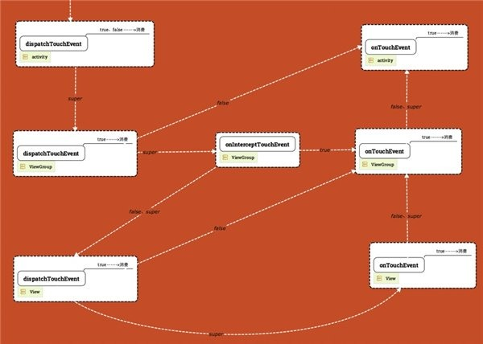

#### activity  所有事件分发方法都调用父类方法

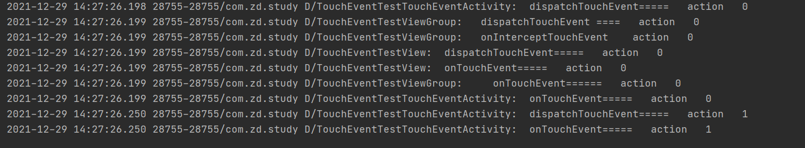

#### dispatchTouchEvent 方法返回true/false

activity 的 dispatchTouchEvent 方法返回true/false 事件直接被消费

- activity 的 dispatchTouchEvent 方法返回true

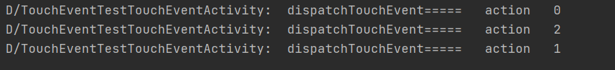

- activity 的 dispatchTouchEvent 方法返回false

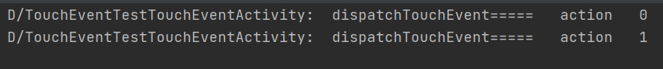

### 总结 ###

activity的dispatchTouchEvent返回true和false事件都会被消费

***

- viewGroup 的 dispatchTouchEvent 方法返回true,事件直接消费

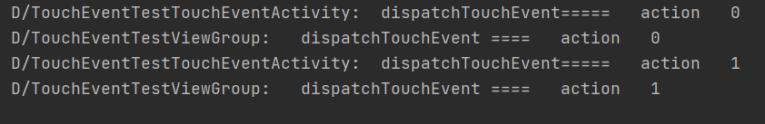

- viewGroup 的 dispatchTouchEvent 方法返回false

*返回false会询问父控件onTouchEvent是否消费事件*

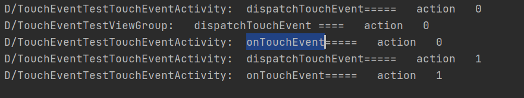

- ViewGroup 的 onInterceptTouchEvent 返回false

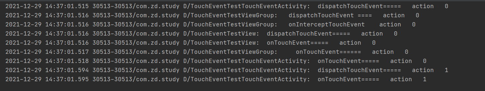

- ViewGroup 的 onInterceptTouchEvent super.onInterceptTouchEvent(ev)
  TouchEvent 方法返回true

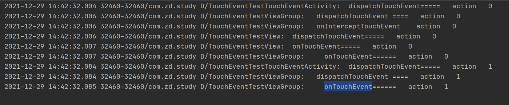

- ViewGroup 的 onInterceptTouchEvent return true TouchEvent
  方法返回super.TouchEvent()

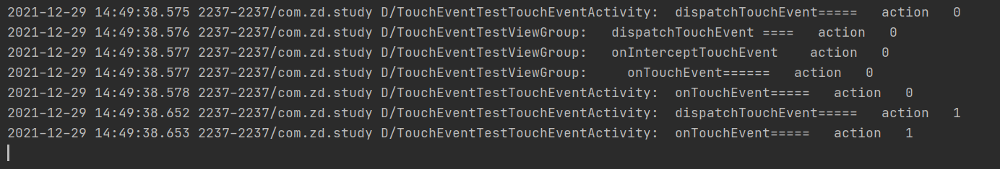

- ViewGroup 的 onInterceptTouchEvent return true TouchEvent 方法返回true

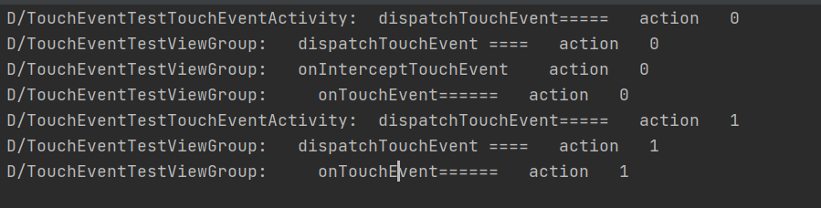

### 总结 ###

viewGroup的dispatchTouchEvent返回false，事件会被传递到父控件的OnTouchEvent

***

- View 的 dispatchTouchEvent 方法返回true 事件直接被消费

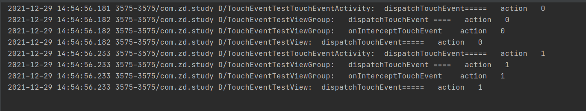

- View 的 dispatchTouchEvent 方法返回false

  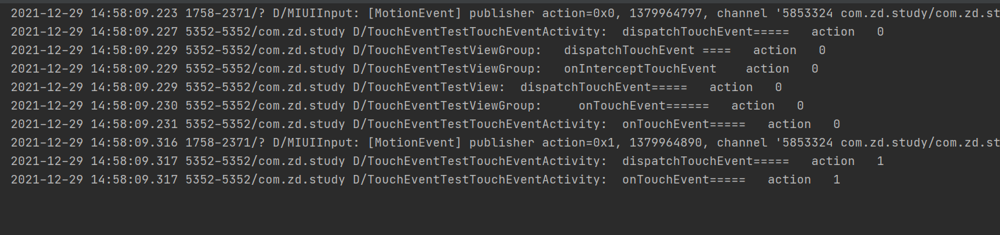

- View 的 TouchEvent 方法返回true,view消费事件

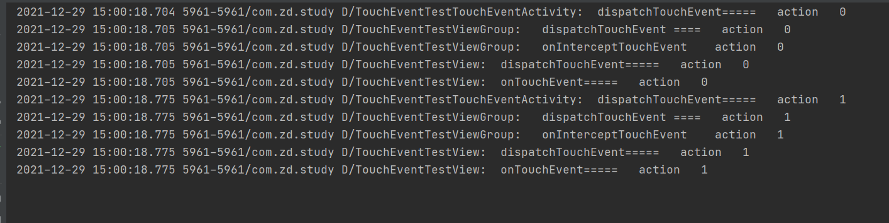

### 总结 ###

view的dispatchTouchEvent返回false，事件会被传递到父控件的OnTouchEvent

#### OnTouch(),OnTouchEvent(),Onclick()方法的优先级

onTouch>onTouchEvent>onClick